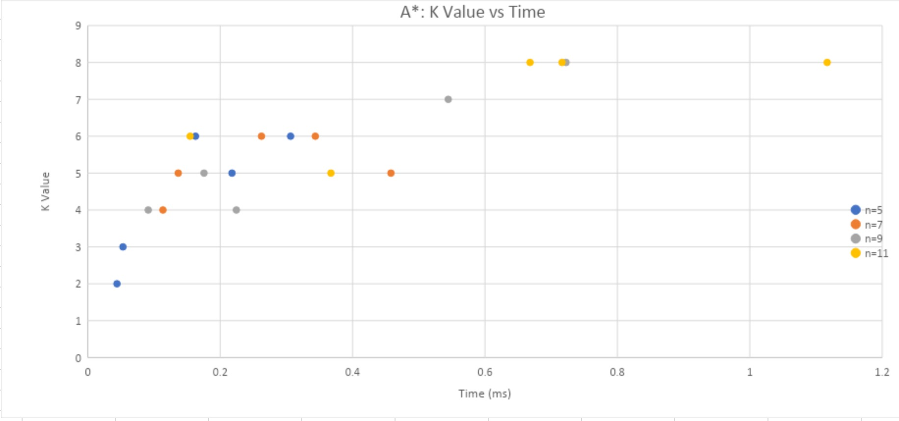

# CS440 Assignment
Manel Bermad and Robert Bonagrua

## Task 1
**Environment** - The grid of n*n cells.<br>
**State Space** - Array of cells that represent a graph.<br>
**Actions** - Move left, right, up or down to another cell based on the number of jumps available to the current cell.<br>
**Perception/Observations** - The neighboring cells the agent is able to currently jump to.<br>
**Transition Function** - Moving to a neighbor based on the number of jumps at the current cell, thus moving into a new state.<br>
**Evaluation metric** - K value. The total number of jumps to get to goal state.<br>

## Task 2
Sample Output from program:
```
TASK 2:
Please enter any size n [1..100] to generate a new graph and a visualization of its solution.
(NOTE: values under 40 are preferable in order to see visualization clearly).

10
Creating 10-by-10 sized puzzle...
Finished creating 10-by-10 sized puzzle.
The solution is: 7
The path to the solution is: (8 , 0)(9 , 0)(2 , 0)(3 , 0)(3 , 9)(7 , 9)(9 , 9)
Found in: 0.19305 ms

```

## Task 3
Puzzles generated based on Task 3 instructions:<br><br>
<br><br>


## Task 4

The graph below shows how the value function increases as the number of iterations increases.


<br>

The graph below shows how computation time increases as the difficulty (or k value) of the puzzle increases

<br>

Both of the graphs shown for Task 4 are a result of the HillCimbing function being run 50 times, at every iteration *i* from 1 to 500. The values plotted are the values averaged over 50 repetitions.

## Task 5
The SPF algorithm, as expected, runs longer than the BFS. This is likely due to the fact that there is larger overhead used for creating and implementing the priority queue. 

As expected, as the size or difficulty of the problem increase, so does the runtime.

## Task 6
We were initally surprised to see that the BFS algorithm outperformed the A* Search algorithm. This was the case for all sizes n = {5, 7, 9 11}. Our best guess is that this is likely do again to the overhead cost of implementing a priority queue in Java.

Sample output for BFS, SPF, and A* respectively with size 11:
```
The solution is: 6
The path to the solution is: (9 , 0)(7 , 0)(7 , 5)(7 , 8)(7 , 10)(10 , 10)
Found in: 0.206202 ms

The solution is: 6
The path to the solution is: (9 , 0)(7 , 0)(7 , 5)(7 , 8)(7 , 10)(10 , 10)
Found in: 0.774601 ms

The solution is: 6
The path to the solution is: (9 , 0)(7 , 0)(7 , 5)(7 , 8)(7 , 10)(10 , 10)
Found in: 0.239938 ms
```
Sample output for BFS, SPF, and A* respectively with size 500:
```
The solution is: 10
The path to the solution is: (122 , 0)(122 , 182)(122 , 155)(122 , 170)(122 , 100)(122 , 11)(122 , 93)(182 , 93)(182 , 199)(199 , 199)
Found in: 5.526452 ms

The solution is: 10
The path to the solution is: (122 , 0)(122 , 182)(122 , 155)(122 , 170)(122 , 100)(122 , 11)(122 , 93)(182 , 93)(182 , 199)(199 , 199)
Found in: 14.907976 ms

The solution is: 10
The path to the solution is: (122 , 0)(122 , 182)(122 , 155)(122 , 170)(122 , 100)(122 , 11)(122 , 93)(182 , 93)(182 , 199)(199 , 199)
Found in: 7.671918 ms
```

## Task 7
### Genetic Algorithm Methodology
The Genetic Algorithm takes in 3 parameters: *n* (which is the dimension of the nxn
puzzle), *p* (which is the number of graphs we start with, or the size of initial population),
and *j*, the number of cycles (which is the number of generation or, the number of times
the genetic ALG will run for).
The ALG first populates the intialPopulation (array of graphs) by generating *p* random
graphs of size *n* by *n*. They are then sorted in descending orders based on their *k* value
(fitness value), and if *p* is odd, the last graph in that order is dropped (this makes
coupling later on easy).

For Selection (GeneticSelection method), we take as input the initial population array. Elitism is applied by keeping the highest ranking graph unchanged, and then we couple graphs based on their ranking in the sorted array. For example, graph1 with graph2, graph3 with graph4 …etc. This type of pairing increases the chance of producing new
puzzles that are equally as difficult— or more.

For Cross-Over (GeneticCrossOver method), we iterate through the pairs (parent1,
parent2) formed in Selection and create 2 new graphs: graph1 first half of rows will be
identical to the ones in parent1, and the second half of rows is identical to the ones in
parent2. We do the opposite for graph2.

For Mutation (GeneticMutation method), we take the array of CrossOvers and mutate
each graph with a probability of 90% (a random generator used). The lower this
probability, the lower the chances of having a better population.

This results in a new population and the 3 genetic steps are repeated j amount of times.

The final return statement of the algorithm is again, the highest ranked graph on the last
population.

### Graphs outputted by Genetic Algorithm:
The first graph below shows how as the number of iterations increases (up to 200), the K value increases only slightly.<br><br>
<br><br>
The next graph shows when the K value approaches around 12, the computation time begins to grow much faster than the K value.


These two graphs show that despite incresing the number of iterations, the K value does not continue to grow much higher, and instead only the computation time required to generate the puzzle continues to grow.
## Task 8

#### BFS


BFS is the fastest search algorithm we implemented on puzzles of these sizes.

#### SPF


The use of SPF was always the slowest. This makes sense because with unweighted edges, it should mirror BFS exactly, with one exception: The cost of creating a Priority Queue.

Therefore, SPF should always run slower than BFS on these puzzles.

#### A* Search



The fact that A* Search runs faster than SPF gives us reason to believe that cost of overhead associated with the Priority Queue was it's bottleneck. Because it outperformed SPF, which is fundamentally the same algorithm as BFS when edges are weightless, we believe that we if we could omit the overhead cost of Java's PrioritQueue class in A*, we would see it run faster than BFS.


## Task 9
### Sample output for 1000 x 1000 sized puzzle:
```
TASK 9:
Performing Hill Climbing algorithm to create a difficult 1000-by-1000 puzzle...

BFS search on result of HillClimbing
The solution is: 16
The path to the solution is: (255 , 0)(255 , 559)(255 , 828)(680 , 828)(680 , 413)(680 , 434)(208 , 434)(788 , 434)(661 , 434)(29 , 434)(937 , 434)(908 , 434)(285 , 434)(285 , 31)(999 , 31)(999 , 999)
Found in: 138.045876 ms

SPF search on result of HillClimbing
The solution is: 16
The path to the solution is: (255 , 0)(255 , 559)(255 , 828)(680 , 828)(680 , 413)(680 , 434)(208 , 434)(788 , 434)(661 , 434)(29 , 434)(937 , 434)(908 , 434)(285 , 434)(285 , 31)(999 , 31)(999 , 999)
Found in: 1237.655531 ms

A* search on result of HillClimbing
The solution is: 16
The path to the solution is: (255 , 0)(255 , 559)(255 , 290)(534 , 290)(534 , 383)(150 , 383)(150 , 680)(579 , 680)(579 , 777)(622 , 777)(688 , 777)(688 , 999)(795 , 999)(190 , 999)(947 , 999)(999 , 999)
Found in: 496.9399 ms
```